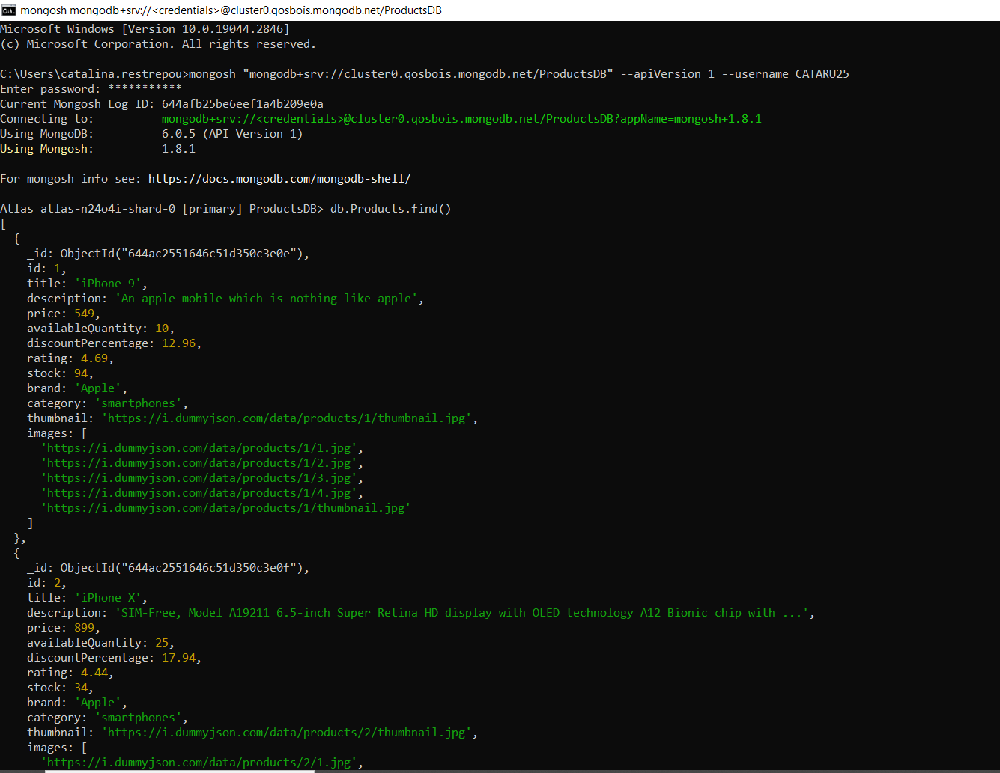

## Parte 1

Conéctate a la base de datos utilizando la consola de MongoDB.
Selecciona la base de datos y la colección que desees utilizar.
Muestra todos los elementos de la colección.

Acción | Query | Evidencia 
:--- | :--- | :---
GET | ` db.Products.find();`|  

Selecciona un elemento específico de la colección y muéstralo.

Edita uno de los elementos de la colección.
Elimina uno de los elementos de la colección.
Para completar esta tarea, debes crear un archivo markdown en el que debes registrar todos los comandos que has utilizado para realizar estas operaciones, así como los resultados obtenidos en la consola de MongoDB. Puedes incluir capturas de pantalla o imágenes si lo deseas, pero asegúrate de que todos los comandos y resultados sean fácilmente legibles.
