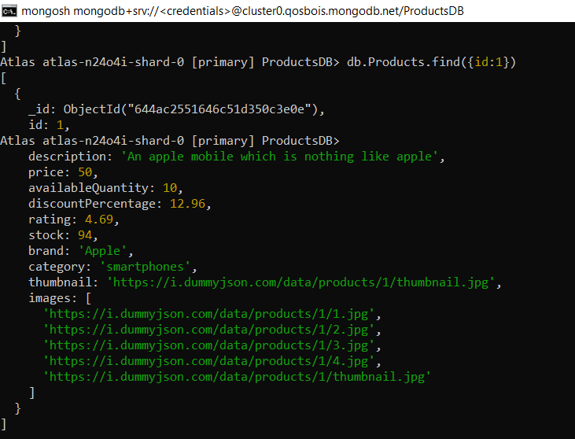
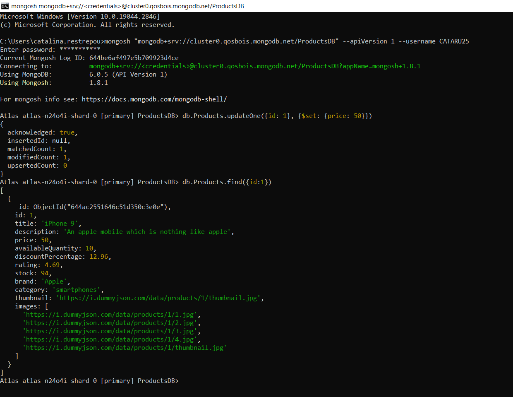
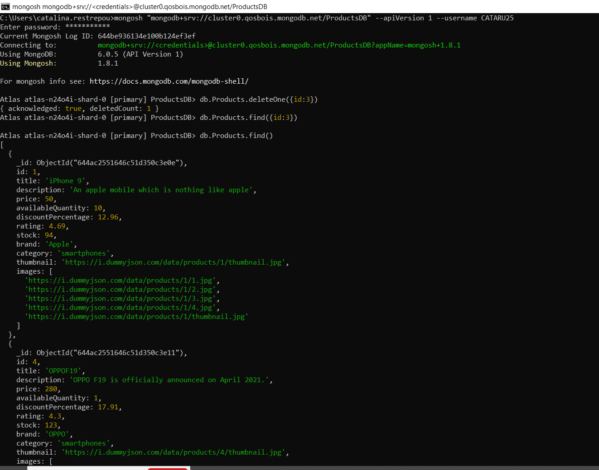

## Parte 1

Conéctate a la base de datos utilizando la consola de MongoDB.
Selecciona la base de datos y la colección que desees utilizar.
Muestra todos los elementos de la colección.

Acción | Query | Evidencia 
:--- | :--- | :---
GET | ` db.Products.find();`| 
GET by ID | ` db.Products.find({id:1});`| 
PATCH | ` db.Products.updateOne({id: 1}, {$set: {price: 50}});`| 
DELETE | ` db.Products.deleteOne({id: 3});`| 
